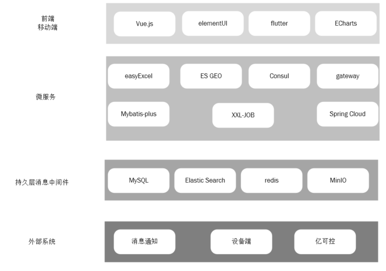

## 1.立可得

 随着立可得公司运营规模的扩大， 设备数量及点位数量迅速增长，合作点位主数量不断增加，原有的单一的管理后台已经无法满足日常管理的需要。 为此立可得公司决定对平台进行一次大版本的升级：主要是将系统做了切分，整体系统分成六大块：

（1）运营管理后台：管理人员使用

（2）合作商后台：为合作的商家（点位主）提供数据查询

（3）运营管理APP：运营人员使用，主要功能是处理运营工单

（4）运维管理APP：运维人员使用，主要功能是处理运维工单

（5）用户小程序：C端用户使用的微信小程序，废除原有的h5移动端。

（6）设备端：封装售货机逻辑

另外将设备监控部分从原有系统中抽离，使用开源项目亿可控来实现对设备的监控，并与立可得进行对接。

### 1.2 产品原型&设计稿

产品原型：

https://app.mockplus.cn/run/prototype/tPerX4XrY4/BSJNfay9MlZ/oA1CE0pr_?dt=iPhone&ha=1&la=1&ps=1

设计稿：

https://app.mockplus.cn/run/design/WWk4pKFL3gM?dt=iPhone&ha=1&la=1&ps=1 

### 1.3 产品需求对比分析

#### 1.3.1 运营管理后台【升级】

##### （1）点位管理

 同一个城市中会部署和运营大量的售货机，单一的区域难以管理和运营相当多数量的设备，所以将设备按照区域进行了分组，抽象出了区域的概念，区域下包含点位，点位上部署着机器。这里的区域不是v1.0中所说的行政区域，而是指根据运营需要划分的区域。

 同时原来运维人员和运营人员和售货机关联的关系取消，将这些人员直接和区域做关联，该区域下的这些运维和运营人员负责该区域下所有设备的运营和运维工作。

 点位新增了商圈的属性，这样之后可以根据商圈进行商品设置的智能推荐。

另外增加了合作商（点为主）增删改查功能。合作商和点位属于1对多关系，也就是一个合作商可以拥有多个点位。

通过下面的图，我们可以清晰的理解区域、点位、设备、人员之间的关系

##### （2）设备管理

 售货机种类多种多样，设备类型管理为设备进行分类，主要对设备货道数量、货道容量进行设置。

设备管理新增“智能排货”

##### （3）人员管理

增加了人员管理

人效统计、人效排名，正向激励制度让公司良性发展。

通过工作量列表，可以看到每个人的完成工单数、进行中工单以及拒绝工单。

##### （4）对账管理

优化分账管理功能，可以查看合作商分成数据以及具体分成详情。

##### （5）统计分析

工作台聚合了销售数据统计、工单数据统计、销售数据趋势分析、商品销量排行榜、用户访问统计和异常设备监控。

##### （6）工单

优化工单管理，将工单拆分为运营工单、运维工单，对工单进行细化管理。运营工单为补货工单；运维工单为装机工单、维修工单、撤机工单。

实现智能补货工单、自动维修工单。

#### 1.3.2 合作商后台【新增】

新增合作商后台，用于合作商查看收益，合作商可以查看每日收益，具体点位收益，收益数据导出。

合作商可以在对账管理页面查询每个点位收益，可以根据时间筛选对账单区间，可以导出对账详情。

#### 1.3.3 运营&运维管理APP【新增】

新增运营APP，增加运营人员与运维人员执行工单入口，真正实现工单处理数字化。可以实时跟进工单实施进度，查看历史工单情况，便于平台整体调度与货品调配。

工作台主要是用户查看自己待办工单任务，显示工作排名。系统会根据运营/运维人员接受工单情况来只能派发待办工单，用户可以直接查看工单详情，对工单进行接受与拒绝操作。

##### （1）待办工单

##### （2）历史工单&进行工单

#### 1.3.4 用户小程序【新增】

由原有的h5工程更换为用户小程序，可以为之后实现线下向线上导流提供基础。3.0版本计划在小程序中添加电商入口。

##### （1）地图导航

用户可以通过小程序进行地图搜索，查看附近售货机设备，之后通过导航指引到售货机处购买商品。这就是从线上向线下导流的具体实现。

##### （2）下单支付

由原来的支付宝支付，更改为微信小程序微信支付。

##### （3）查看订单

可以在小程序中查看订单记录。

## 2.立可得2.0系统设计

### 2.1 技术升级对比分析

### 2.2 系统架构图v2.0

可以看到由于2.0系统伴随着业务的增长，原有的Spring
Task已经遇到了瓶颈，不能满足同时处理大量售货机相关的定时任务了，这里我们引入了XXL-JOB来实现任务的分布式集群分片调度；随着订单量的增长，MySQL数据库的查询效率逐渐出现了比较慢的情况，而且扩容变得相对越来越困难，此时我们引入了ElasticSearch来实现订单的存储和搜索，因为订单数据一旦完成就基本不会再变更了，所以使用ElasticSearch能显著提高查询效率，而且为了增加购物体验，售货机上增加了地理位置的信息，将这些信息同步到ES中可以轻松的实现基于地理位置的范围搜索；我们将服务器端的各微服务之间的消息通知和售货机客户端的数据通信都统一替换成了EMQ，降低了后期维护成本的同事用一套消息系统打通了所有端点；用MinIO替换了阿里云收费的OSS，搭建了自己的轻量级OSS文件系统；对接微信小程序实现用户一站式购物体验，等等更多的业务和技术上的升级。

### 2.3 库表设计v2.0

#### 2.3.1 售货机库

| 新增表             |                      |                                      |
| ------------------ | -------------------- | ------------------------------------ |
| tb_business        | 商圈表               |                                      |
| tb_region          | 区域表               |                                      |
| **变化表**         |                      |                                      |
| tb_channel         | 货道表               |                                      |
|                    | 新增price价格字段    | 为了实现同一商品在不同售货机价格不同 |
| tb_node            | 点位表               |                                      |
|                    | 新增region_id区域Id  | 新增区域业务                         |
|                    | business_id商圈id    | 新增商圈业务                         |
|                    | owner_id合作商Id     | 新增合作商业务                       |
|                    | owner_name合作商名称 | 新增合作商业务                       |
| tb_sku             | 商品表               |                                      |
|                    | 新增brand_name       | 新增商品品牌                         |
| tb_vending_machine | 售货机表             |                                      |
|                    | business_id商圈id    | 新增商圈业务                         |
|                    | 新增region_id区域Id  | 新增区域业务                         |
|                    | owner_id合作商Id     | 新增合作商业务                       |
|                    | owner_name合作商名称 | 新增合作商业务                       |
|                    | longitudes           | 经度                                 |
|                    | latitude             | 纬度                                 |
| tb_vm_type         | 售货机类型表         |                                      |
|                    | 新增model            | 类型编码                             |
|                    | Image                | 图片                                 |

#### 2.3.2 工单库

| 新增表          |                          |                   |
| --------------- | ------------------------ | ----------------- |
| tb_task_collect | 工单统计表               | 为了实现工单统计  |
| 变化表          |                          |                   |
| tb_job          | 任务表                   |                   |
|                 | 删除原来里面的执行时间列 | 改到XXL-JOB中配置 |
| tb_task         | 工单表                   |                   |
|                 | 添加区域字段region_id    | 新增区域相关逻辑  |
| tb_task_details |                          |                   |
|                 | 新增sku_id               |                   |
|                 | 新增sku_name             |                   |

#### 2.3.3 用户库

| 新增表     |                 |                        |
| ---------- | --------------- | ---------------------- |
| tb_partner | 合作商表        | 新增合作商业务         |
| 变化表     |                 |                        |
| tb_user    | 用户表          |                        |
|            | 新增mobile      | 手机号，接受登录验证码 |
|            | 新增region_id   | 区域逻辑               |
|            | 新增region_name | 区域逻辑               |
|            | 新增image       | 新增用户头像           |

### 2.4 工程结构调整

将我们项目提供的配套资料代码(第2天资料/代码)导入到工程中：

立可得2.0的工程结构如下

对比立可得1.0，结构有如下变化

（1）新增小程序端服务

（2）新增C端网关，针对用户小程序端的专用网关

（3）新增服务公共模块

（4）将所有微服务整理到lkd_service模块下，结构更加清晰

### 2.5 环境准备

为了让大家快速上手，我们给大家提供了配套的vm镜像文件（第2天资料），我们直接将镜像挂载到VMware Workstation 中，使用NAT方式连接。

镜像的ip地址为192.168.200.128 ，系统的登录名是root ，密码是123456

进入系统后，我们可以看到里面已经安装好我们必须的各种软件环境

consul的控制台地址： http://192.168.200.128:8500/

mysql数据库的用户名与密码：root/root123  
